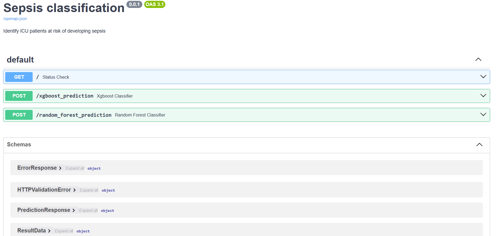
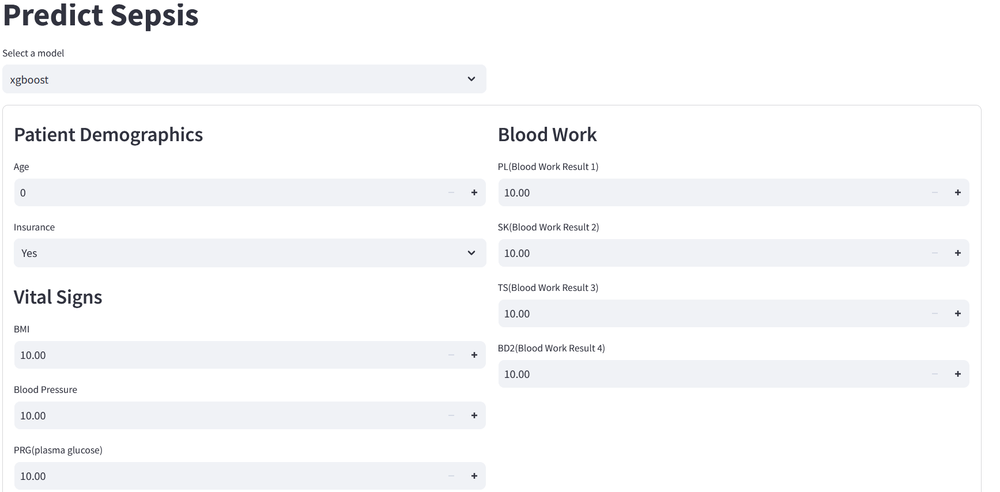
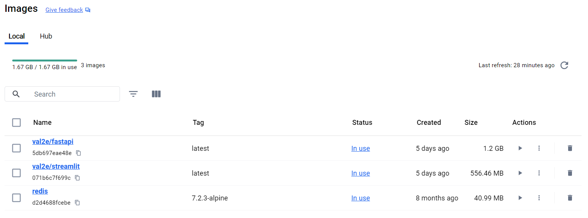

# Building Machine Learning API with FastAPI to Predict Sepsis

This repository contains a machine learning API developed using FastAPI for predicting sepsis in ICU patients. The project follows the CRISP-DM methodology and focuses on early detection to improve patient outcomes, optimize resource allocation, and reduce healthcare costs.

## Table of Contents
1. [Introduction](#introduction)
2. [Business Understanding](#business-understanding)
    - [Project Overview](#project-overview)
    - [Key Objectives](#key-objectives)
    - [Hypothesis](#hypothesis)
    - [Analytical Questions](#analytical-questions)
3. [Data Understanding](#data-understanding)
4. [Data Preparation](#data-preparation)
5. [Modeling and Evaluation](#modeling-and-evaluation)
6. [Deployment](#deployment)
7. [Frontend Application with Streamlit](#frontend-application-with-streamlit)
8. [Docker Deployment](#docker-deployment)
9. [Conclusion](#conclusion)
10. [Setup](#setup)
11. [👥 Authors](#-authors)
12. [⭐️ Show Your Support](#️-show-your-support)
13. [🙏 Acknowledgments](#-acknowledgments)
14. [📝 License](#-license)

## Introduction
Building robust APIs is a cornerstone of modern software development, and FastAPI is a powerful framework that simplifies this process. This project focuses on a healthcare initiative aimed at predicting sepsis in ICU patients.

## Summary
| Project Code | Project Name | Published Article | App Link | Libraries Used |
|--------------|--------------|-------------------|----------|----------------|
| LP5          | Building <br> Machine <br> Learning <br> API's with <br> FastAPI | [Medium <br> Article](https://medium.com/@vezabuku/building-a-machine-learning-api-with-fastapi-04c5ea7bdbae) | [App Link](https://gabcares-team-curium.hf.space/) | Pandas <br> Numpy <br> Matplotlib <br> Seaborn <br> Sklearn |


## Business Understanding

### Project Overview
The project's objective is to develop a predictive model that identifies ICU patients at risk of developing sepsis. Early identification can significantly improve treatment outcomes, reduce mortality rates, and lower healthcare costs through timely interventions.

### Key Objectives
- **Early Detection**: Predict which patients in the ICU are likely to develop sepsis, allowing healthcare providers to intervene early and improve patient outcomes.
- **Resource Allocation**: Optimize the allocation of medical resources by focusing attention and care on high-risk patients.
- **Cost Reduction**: Reduce healthcare costs associated with sepsis by preventing its occurrence through early interventions.

### Hypothesis
- **Null Hypothesis (Ho)**: Older patients (age 60 and above) are less likely to develop sepsis compared to younger patients (below 60 years).
- **Alternate Hypothesis (Ha)**: Older patients (age 60 and above) are more likely to develop sepsis compared to younger patients (below 60 years).

### Analytical Questions
1. Is there a relationship between body mass index (M11) and the development of sepsis?
2. Are there noticeable differences in blood pressure (PR) readings between sepsis-positive and sepsis-negative patients?
3. How do plasma glucose levels (PRG) differ between patients who develop sepsis and those who do not?
4. Does a patient having an insurance card influence sepsis development?
5. What is the average/median age of patients who develop sepsis and those without sepsis?

## Data Understanding
To build an effective API, we must first understand the dataset and the variables involved. The data contains various health metrics and patient information, crucial for predicting sepsis.

## Data Preparation
Before starting API development, preparing the data is crucial. I began by assessing the balance of the dataset, finding it imbalanced with 65.28% negative and 34.72% positive cases of sepsis. Next, I removed outliers and split the data into training and testing sets. I then encoded the target variable (y) using a LabelEncoder. To streamline preprocessing, I created a pipeline that includes a SimpleImputer with a median strategy, a StandardScaler, and a FunctionTransformer for log transformation.

## Modeling and Evaluation
The next step involved developing the predictive model. I selected appropriate algorithms and trained several models, including Logistic Regression, Random Forest Classifier, XGBoost Classifier, and Stochastic Gradient Descent. I assessed the models using both the imbalanced dataset with SMOTE for balancing and the balanced dataset using the scikit-learn pipeline. After fine-tuning the hyperparameters, the Random Forest model emerged as the best performer.

## Deployment
With my models validated, I developed the API using FastAPI. I loaded environment variables from a .env file using dotenv, created a FastAPI instance, defined Pydantic models for structuring input data, implemented a caching mechanism for loading machine learning pipelines and encoders, and created API endpoints to handle predictions.



## Frontend Application with Streamlit
For the frontend, Streamlit was utilized to create an interactive web interface that allows users to make predictions about sepsis risk based on input data. Streamlit connects to the FastAPI backend, which serves the predictive models, and displays results in real-time, providing immediate feedback and insights.



## Docker Deployment
To efficiently deploy and manage the application, Docker was used to containerize both the FastAPI backend and the Streamlit frontend. Docker ensures that the application runs consistently across different environments. Docker Compose was used to define and run multiple containers as a single service, including containers for FastAPI, Streamlit, and Redis.



## Conclusion
By combining the CRISP-DM methodology, FastAPI, Streamlit, and Docker, I have built, deployed, and managed a robust sepsis prediction system. Docker has been instrumental in containerizing and deploying the application, ensuring consistency across various environments. FastAPI provided a high-performance backend, while Streamlit offered an intuitive user interface, making it easy to interact with the predictive models. Together, these technologies have enabled me to create a comprehensive solution for predictive analytics in healthcare, enhancing patient outcomes and optimizing resource use.

## Setup
To get started with the project, follow these steps:

1. **Clone the repository**:
    ```bash
    git clone https://github.com/valiantezabuku/Building-Machine-Learning-API-s-with-FastAPI.git
    ```

2. **Create and activate a virtual environment**:
    ```bash
    python -m venv venv
    venv\Scripts\activate
    ```

3. **Install the dependencies**:
    ```bash
    pip install -r requirements.txt
    ```

4. **Run the FastAPI server**:
    ```bash
    uvicorn api:app --reload
    ```

5. **Run the Streamlit frontend**:
    ```bash
    streamlit run app.py
    ```

6. **Docker Deployment**:
    ```bash
    docker-compose up --build
    ```

## 👥 Authors
Adiru Valiant Ezabuku

- Email: vezabuku09@gmail.com
- LinkedIn: [LinkedIn](https://www.linkedin.com/in/valiant-ezabuku/)

## ⭐️ Show Your Support
If you like this project, kindly show some love and give it a 🌟 **STAR** 🌟

## 🙏 Acknowledgments
I extend my heartfelt thanks to all my tutors at Azubi Africa and my dedicated team members for their guidance, support, and hard work throughout this project. Their expertise, insights, and collaboration significantly contributed to shaping the analysis and outcomes.

## 📝 License
This project is [MIT](./LICENSE) licensed.
